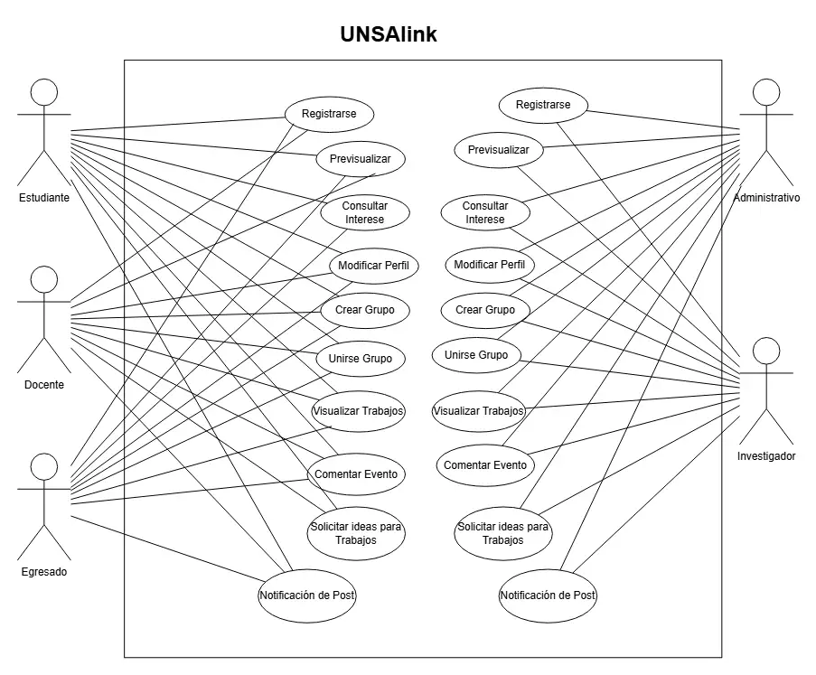
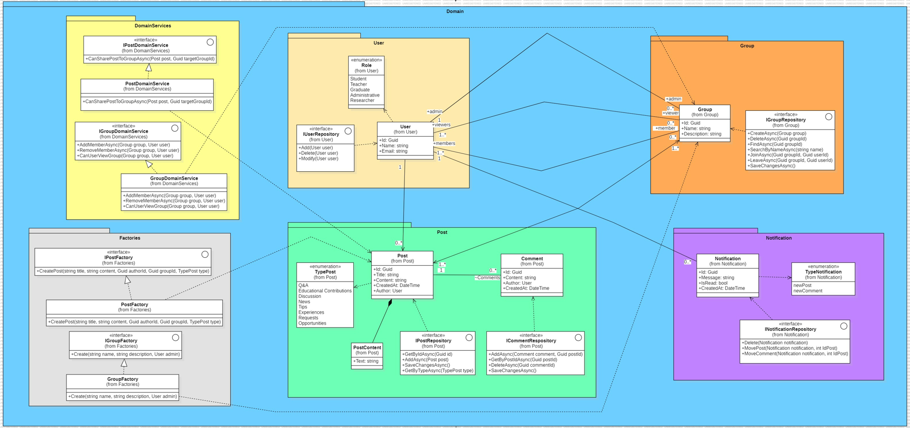
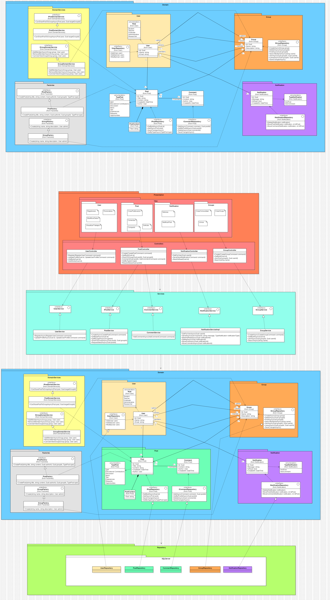
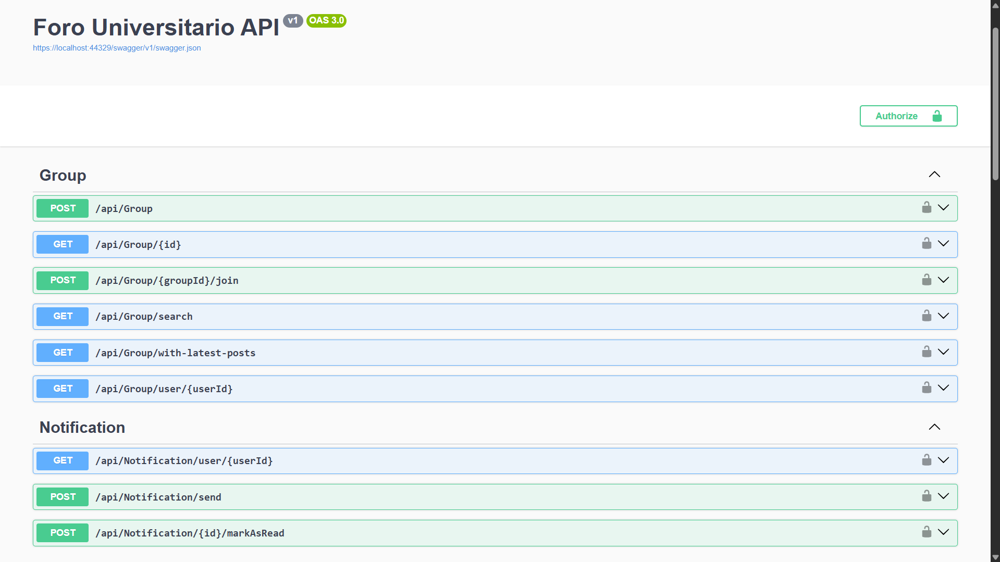
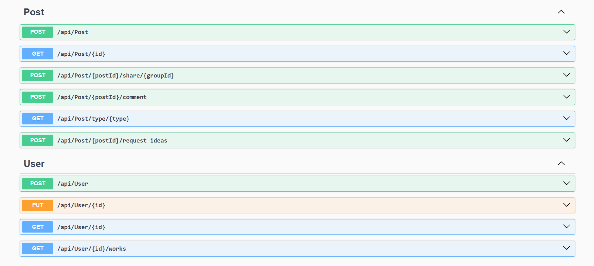

# UNSAlink

## Integrantes
- Jair David Torres Barra.
- Jose Rodrigo Cari Almiron.
- Alex Enrique Cañapataña Vargas.
- Jesus Salvador Quinteros Condori.

## Contexto

UNSAlink nace con la intención de mejorar la interacción entre estudiantes, docentes y egresados de la Universidad Nacional de San Agustín, brindando un entorno digital seguro para el intercambio de conocimientos, oportunidades y recursos.

## ¿Qué es UNSAlink?

Es una plataforma web que funciona como una red universitaria donde los miembros pueden comunicarse, colaborar en proyectos, compartir intereses y participar activamente en la comunidad académica.

## Objetivos

### 🎯 Objetivo General

Diseñar e implementar una red social universitaria que fomente la colaboración, la comunicación y el desarrollo integral de los estudiantes de la UNSA.

### 📌 Objetivos Específicos

- Conectar estudiantes con intereses similares mediante filtros inteligentes.
- Ofrecer un espacio para compartir eventos académicos y extracurriculares.
- Proporcionar herramientas de comunicación como chat y foros.
- Integrar funcionalidades que preparen a los estudiantes para el mundo profesional.

## Propuesta

Nuestra propuesta consiste en desarrollar una solución digital moderna y funcional que reúna todas las herramientas necesarias para la interacción universitaria, apoyando tanto la vida académica como el crecimiento personal de los usuarios.

## Beneficios

- Mayor conexión entre miembros de la comunidad universitaria.
- Acceso a eventos, noticias y recursos relevantes.
- Fortalecimiento del sentido de comunidad dentro de la UNSA.
- Fomento del aprendizaje colaborativo.

## Impacto Social

Este proyecto busca empoderar a los estudiantes creando un espacio inclusivo y accesible que reduzca la brecha digital y promueva la participación activa en la vida universitaria.

## 🎯 Funcionalidades de Alto Nivel (Diagrama de Casos de Uso)

## ✨ Prototipo (o GUI)

https://www.figma.com/design/cyspGkz0LOdwwIw2VNx517/UNSAlink?node-id=0-1&p=f&t=pSsgq7EzpiadQgGR-0

## 📚 Modelo de Dominio: Diagrama de Clases + Módulos

## 📚 Vista General de Arquitetura: Diagrama de Paquetes + Clases

## ✨ Trello

https://trello.com/b/asrftQrL/unsalink

## 🔍 Interfaz Gráfica para la Exploración y Prueba de Endpoints de la API (Swagger UI)

