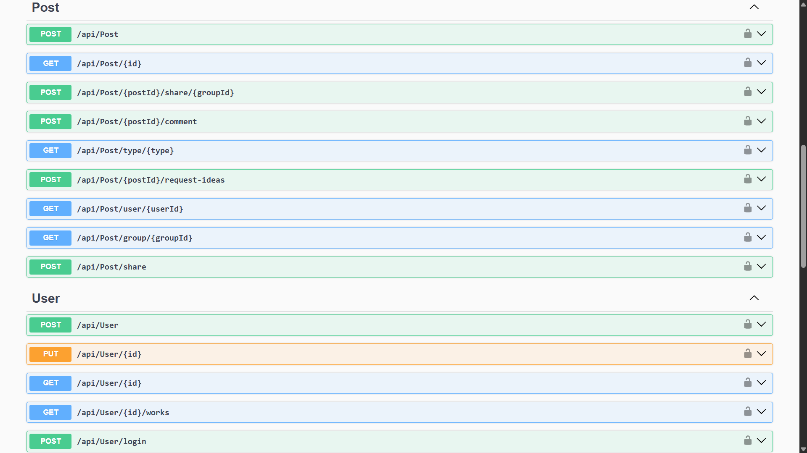

# UNSAlink

---

## Integrantes
- Jair David Torres Barra
- Jose Rodrigo Cari Almiron
- Alex Enrique Cañapataña Vargas
- Jesus Salvador Quinteros Condori

---

# Índice

1. [Propósito del Proyecto](#1-propósito-del-proyecto)
2. [Funcionalidades](#2-funcionalidades)  
   2.1 [Diagrama de Casos de Uso (UML)](#21-diagrama-de-casos-de-uso-uml)  
   2.2 [Prototipo / GUI](#22-prototipo--gui)
3. [Modelo de Dominio: Diagrama de Clases + Módulos](#3-modelo-de-dominio-diagrama-de-clases--módulos)  
4. [Visión General de Arquitectura: DDD y Clean Architecture + Diagrama de Paquetes + Clases](#4-visión-general-de-arquitectura-ddd-y-clean-architecture--diagrama-de-paquetes--clases)  
5. [Prácticas de Desarrollo Aplicadas](#5-prácticas-de-desarrollo-aplicadas)  
   5.1 [Estilos de Programación](#51-estilos-de-programación)  
   5.2 [Convenciones de Codificación](#52-convenciones-de-codificación)  
   5.3 [Código Limpio (Clean Code)](#53-código-limpio-clean-code)  
   5.4 [Principios SOLID](#54-principios-solid)  
   5.5 [Domain-driven Design (DDD) / Clean Architecture](#55-domain-driven-design-ddd--clean-architecture)  
   &nbsp;&nbsp;&nbsp;&nbsp;5.5.1 [Entidades, Objetos de Valor y Servicios de Dominio](#551-entidades-objetos-de-valor-y-servicios-de-dominio)  
   &nbsp;&nbsp;&nbsp;&nbsp;5.5.2 [Agregados y Módulos](#552-agregados-y-módulos)  
   &nbsp;&nbsp;&nbsp;&nbsp;5.5.3 [Fábricas](#553-fábricas)  
   &nbsp;&nbsp;&nbsp;&nbsp;5.5.4 [Repositorios](#554-repositorios)  
   &nbsp;&nbsp;&nbsp;&nbsp;5.5.5 [Arquitectura en Capas](#555-arquitectura-en-capas)
6. [Gestión de Proyecto](#6-gestión-de-proyecto)  
   6.1 [Tablero de Trello](#61-tablero-de-trello)

---

## 1. Propósito del Proyecto

## Contexto

UNSAlink nace con la intención de mejorar la interacción entre estudiantes, docentes y egresados de la Universidad Nacional de San Agustín, brindando un entorno digital seguro para el intercambio de conocimientos, oportunidades y recursos.

## ¿Qué es UNSAlink?

Es una plataforma web que funciona como una red universitaria donde los miembros pueden comunicarse, colaborar en proyectos, compartir intereses y participar activamente en la comunidad académica.

## Objetivos

### 🎯 Objetivo General

Diseñar e implementar una red social universitaria que fomente la colaboración, la comunicación y el desarrollo integral de los estudiantes de la UNSA.

### 📌 Objetivos Específicos

- Conectar estudiantes con intereses similares mediante filtros inteligentes.
- Ofrecer un espacio para compartir eventos académicos y extracurriculares.
- Proporcionar herramientas de comunicación como chat y foros.
- Integrar funcionalidades que preparen a los estudiantes para el mundo profesional.

## Propuesta

Nuestra propuesta consiste en desarrollar una solución digital moderna y funcional que reúna todas las herramientas necesarias para la interacción universitaria, apoyando tanto la vida académica como el crecimiento personal de los usuarios.

## Beneficios

- Mayor conexión entre miembros de la comunidad universitaria.
- Acceso a eventos, noticias y recursos relevantes.
- Fortalecimiento del sentido de comunidad dentro de la UNSA.
- Fomento del aprendizaje colaborativo.

---

## 2. Funcionalidades

### 2.1 Diagrama de Casos de Uso (UML)


### 2.2 Prototipo / GUI

https://www.figma.com/design/cyspGkz0LOdwwIw2VNx517/UNSAlink?node-id=0-1&p=f&t=pSsgq7EzpiadQgGR-0

---

## 3. Modelo de Dominio: Diagrama de Clases + Módulos


---

## 4. Visión General de Arquitectura: DDD y Clean Architecture + Diagrama de Paquetes + Clases


---

## 5. Prácticas de Desarrollo Aplicadas

### 5.1 Estilos de Programación

#### Persistent Tables

**Descripción**  
El estilo *Persistent Tables* se caracteriza por representar los datos del dominio como tablas en una base de datos relacional, manipuladas mediante operaciones de acceso (CRUD). Cada clase de dominio refleja directamente una tabla.

**Aplicación**  
Este proyecto utiliza **Entity Framework Core** para mapear objetos de dominio a tablas persistentes. Un ejemplo claro es la clase `User` y su correspondiente configuración de mapeo.

**Fragmento de Código**  

**Entidad de dominio (`User.cs`)**
```csharp
public class User
{
    public Guid Id { get; private set; }
    public string Name { get; private set; } = string.Empty;
    public string Email { get; private set; } = string.Empty;
    public string PasswordHash { get; private set; }
    public Role Role { get; private set; }

    public List<Post> Posts { get; private set; } = new();

    public User(Guid id, string name, string email, Role role, string passwordHash)
    {
        Id = id;
        Name = name;
        Email = email;
        PasswordHash = passwordHash;
        Role = role;
    }

    public void UpdateProfile(string name, string email)
    {
        Name = name;
        Email = email;
    }
}
````

**Configuración de entidad (`UserConfiguration.cs`)**

```csharp
public class UserConfiguration : IEntityTypeConfiguration<User>
{
    public void Configure(EntityTypeBuilder<User> builder)
    {
        builder.ToTable("Users");

        builder.HasKey(u => u.Id);
        builder.Property(u => u.Name).IsRequired().HasMaxLength(100);
        builder.Property(u => u.Email).IsRequired().HasMaxLength(150);
        builder.Property(u => u.Role).IsRequired().HasConversion<string>();

        builder.HasMany(u => u.Posts)
               .WithOne(p => p.Author)
               .HasForeignKey(p => p.AuthorId)
               .OnDelete(DeleteBehavior.Cascade);
    }
}
```

**Acceso a datos (`UserRepository.cs`)**

```csharp
public class UserRepository : IUserRepository
{
    private readonly ForumDbContext _context;

    public async Task AddAsync(User user)
    {
        await _context.Users.AddAsync(user);
        await _context.SaveChangesAsync();
    }

    public async Task<User?> GetByIdAsync(Guid id)
    {
        return await _context.Users.FindAsync(id);
    }

    public async Task ModifyAsync(User user)
    {
        _context.Users.Update(user);
        await _context.SaveChangesAsync();
    }

    public async Task DeleteAsync(Guid id)
    {
        var user = await _context.Users.FindAsync(id);
        if (user != null)
        {
            _context.Users.Remove(user);
            await _context.SaveChangesAsync();
        }
    }
}
```

---

#### RESTful

**Descripción**
El estilo *RESTful* se basa en el protocolo HTTP y sus métodos (GET, POST, PUT, DELETE) para definir operaciones sobre recursos. Los controladores siguen convenciones claras tanto en URL como en el uso de verbos HTTP.

**Aplicación**
El controlador `UserController` expone endpoints RESTful para gestionar los usuarios.

**Fragmento de Código**

**Controlador (`UserController.cs`)**

```csharp
[ApiController]
[Route("api/[controller]")]
public class UserController : ControllerBase
{
    private readonly IUserService _userService;

    [HttpPost]
    public async Task<IActionResult> Register([FromBody] RegisterUserCommand command)
    {
        if (!ModelState.IsValid)
            return BadRequest(ModelState);

        var id = await _userService.RegisterAsync(command);
        return CreatedAtAction(nameof(GetById), new { id }, null);
    }

    [HttpPut("{id}")]
    public async Task<IActionResult> UpdateProfile(Guid id, [FromBody] UpdateUserProfileCommand command)
    {
        await _userService.UpdateProfileAsync(id, command);
        return NoContent();
    }

    [HttpGet("{id}")]
    public async Task<IActionResult> GetById(Guid id)
    {
        var user = await _userService.GetByIdAsync(id);
        return user == null ? NotFound() : Ok(user);
    }

    [Authorize]
    [HttpGet("{id}/works")]
    public async Task<IActionResult> GetWorks(Guid id)
    {
        var works = await _userService.GetWorksAsync(id);
        return Ok(works);
    }

    [HttpPost("login")]
    public async Task<IActionResult> Login([FromBody] LoginUserCommand command)
    {
        try
        {
            var token = await _userService.LoginAsync(command);
            return Ok(new { Token = token });
        }
        catch (UnauthorizedAccessException)
        {
            return Unauthorized("Invalid credentials");
        }
    }
}
```

**Cliente REST (Vue) – `LoginView.vue`**

```javascript
const login = async () => {
  try {
    const response = await axios.post('https://localhost:44329/api/User/login', {
      name: username.value.trim(),
      password: password.value.trim()
    })

    const token = response.data.token
    if (token) {
      const payload = JSON.parse(atob(token.split('.')[1]))
      const userId = payload.sub

      localStorage.setItem('token', token)
      localStorage.setItem('userId', userId)

      router.push('/home')
    }
  } catch (error) {
    alert('Usuario o contraseña incorrectos')
  }
}
```

---

#### Things

**Descripción**
Este estilo se centra en la representación explícita de entidades como "cosas" con atributos y comportamientos encapsulados. Las entidades deben tener coherencia interna y una clara identidad en el dominio.

**Aplicación**
La clase `User` es un ejemplo de una "cosa" del dominio, con identidad, atributos y comportamiento encapsulado.

**Fragmento de Código**

**Entidad (`User.cs`)**

```csharp
public class User
{
    public Guid Id { get; private set; }
    public string Name { get; private set; } = string.Empty;
    public string Email { get; private set; } = string.Empty;
    public string PasswordHash { get; private set; }
    public Role Role { get; private set; }

    public List<Post> Posts { get; private set; } = new();

    private User() { }

    public User(Guid id, string name, string email, Role role, string passwordHash)
    {
        Id = id;
        Name = name;
        Email = email;
        PasswordHash = passwordHash;
        Role = role;
    }

    public void UpdateProfile(string name, string email)
    {
        Name = name;
        Email = email;
    }
}
```

Esta clase representa una *cosa* con estado interno y operaciones que modifican su comportamiento, respetando el enfoque de objetos ricos en comportamiento y encapsulamiento.

---

### 5.2 Convenciones de Codificación

### 5.3 Código Limpio (Clean Code)

### 5.4 Principios SOLID

### 5.5 Domain-driven Design (DDD) / Clean Architecture

#### 5.5.1 Entidades, Objetos de Valor y Servicios de Dominio

#### 5.5.2 Agregados y Módulos

#### 5.5.3 Fábricas

#### 5.5.4 Repositorios

#### 5.5.5 Arquitectura en Capas

---

## 6. Gestión de Proyecto

### 6.1 Tablero de Trello

https://trello.com/b/asrftQrL/unsalink


---

## 🔍 Interfaz Gráfica para la Exploración y Prueba de Endpoints de la API (Swagger UI)



