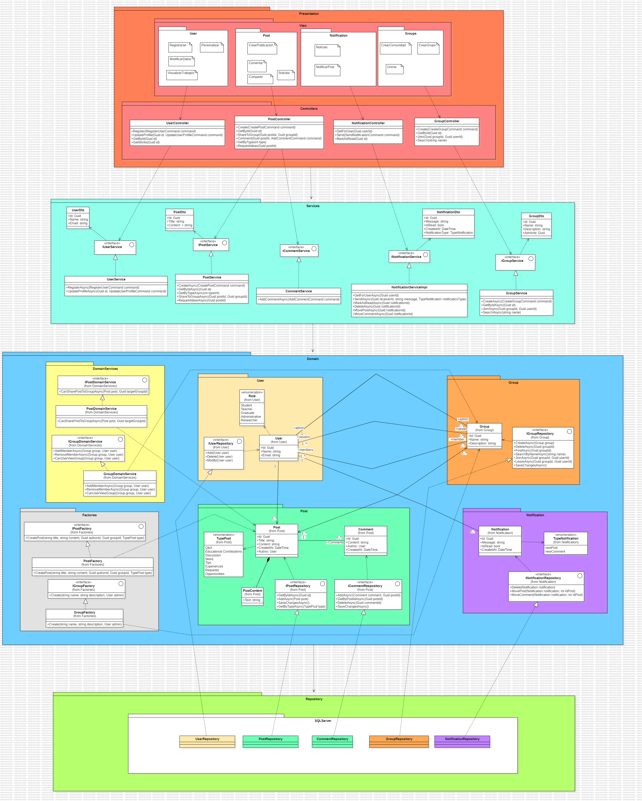

# UNSAlink

---

## Integrantes
- Jair David Torres Barra
- Jose Rodrigo Cari Almiron
- Alex Enrique Cañapataña Vargas
- Jesus Salvador Quinteros Condori

---

# Índice

1. [Propósito del Proyecto](#1-propósito-del-proyecto)
2. [Funcionalidades](#2-funcionalidades)  
   2.1 [Diagrama de Casos de Uso (UML)](#21-diagrama-de-casos-de-uso-uml)  
   2.2 [Prototipo / GUI](#22-prototipo--gui)
3. [Modelo de Dominio: Diagrama de Clases + Módulos](#3-modelo-de-dominio-diagrama-de-clases--módulos)  
4. [Visión General de Arquitectura: DDD y Clean Architecture + Diagrama de Paquetes + Clases](#4-visión-general-de-arquitectura-ddd-y-clean-architecture--diagrama-de-paquetes--clases)  
5. [Prácticas de Desarrollo Aplicadas](#5-prácticas-de-desarrollo-aplicadas)  
   5.1 [Estilos de Programación](#51-estilos-de-programación)  
   5.2 [Convenciones de Codificación](#52-convenciones-de-codificación)  
   5.3 [Código Limpio (Clean Code)](#53-código-limpio-clean-code)  
   5.4 [Principios SOLID](#54-principios-solid)  
   5.5 [Domain-driven Design (DDD) / Clean Architecture](#55-domain-driven-design-ddd--clean-architecture)  
   &nbsp;&nbsp;&nbsp;&nbsp;5.5.1 [Entidades, Objetos de Valor y Servicios de Dominio](#551-entidades-objetos-de-valor-y-servicios-de-dominio)  
   &nbsp;&nbsp;&nbsp;&nbsp;5.5.2 [Agregados y Módulos](#552-agregados-y-módulos)  
   &nbsp;&nbsp;&nbsp;&nbsp;5.5.3 [Fábricas](#553-fábricas)  
   &nbsp;&nbsp;&nbsp;&nbsp;5.5.4 [Repositorios](#554-repositorios)  
   &nbsp;&nbsp;&nbsp;&nbsp;5.5.5 [Arquitectura en Capas](#555-arquitectura-en-capas)
6. [Gestión de Proyecto](#6-gestión-de-proyecto)  
   6.1 [Tablero de Trello](#61-tablero-de-trello)

---

## 1. Propósito del Proyecto

---

## Contexto

UNSAlink nace con la intención de mejorar la interacción entre estudiantes, docentes y egresados de la Universidad Nacional de San Agustín, brindando un entorno digital seguro para el intercambio de conocimientos, oportunidades y recursos.

## ¿Qué es UNSAlink?

Es una plataforma web que funciona como una red universitaria donde los miembros pueden comunicarse, colaborar en proyectos, compartir intereses y participar activamente en la comunidad académica.

## Objetivos

### 🎯 Objetivo General

Diseñar e implementar una red social universitaria que fomente la colaboración, la comunicación y el desarrollo integral de los estudiantes de la UNSA.

### 📌 Objetivos Específicos

- Conectar estudiantes con intereses similares mediante filtros inteligentes.
- Ofrecer un espacio para compartir eventos académicos y extracurriculares.
- Proporcionar herramientas de comunicación como chat y foros.
- Integrar funcionalidades que preparen a los estudiantes para el mundo profesional.

## Propuesta

Nuestra propuesta consiste en desarrollar una solución digital moderna y funcional que reúna todas las herramientas necesarias para la interacción universitaria, apoyando tanto la vida académica como el crecimiento personal de los usuarios.

## Beneficios

- Mayor conexión entre miembros de la comunidad universitaria.
- Acceso a eventos, noticias y recursos relevantes.
- Fortalecimiento del sentido de comunidad dentro de la UNSA.
- Fomento del aprendizaje colaborativo.

---

## 2. Funcionalidades

---

### 2.1 Diagrama de Casos de Uso (UML)


---

### 2.2 Prototipo / GUI

https://www.figma.com/design/cyspGkz0LOdwwIw2VNx517/UNSAlink?node-id=0-1&p=f&t=pSsgq7EzpiadQgGR-0

---

## 3. Modelo de Dominio: Diagrama de Clases + Módulos


---

## 4. Visión General de Arquitectura: DDD y Clean Architecture + Diagrama de Paquetes + Clases



---

## 5. Prácticas de Desarrollo Aplicadas

---

### 5.1 Estilos de Programación

---

#### Persistent Tables

**Descripción**  
El estilo *Persistent Tables* se caracteriza por representar los datos del dominio como tablas en una base de datos relacional, manipuladas mediante operaciones de acceso (CRUD). Cada clase de dominio refleja directamente una tabla.

**Aplicación**  
Este proyecto utiliza **Entity Framework Core** para mapear objetos de dominio a tablas persistentes. Un ejemplo claro es la clase `User` y su correspondiente configuración de mapeo.

**Fragmento de Código**  

**Entidad de dominio (`User.cs`)**
```csharp
public class User
{
    public Guid Id { get; private set; }
    public string Name { get; private set; } = string.Empty;
    public string Email { get; private set; } = string.Empty;
    public string PasswordHash { get; private set; }
    public Role Role { get; private set; }

    public List<Post> Posts { get; private set; } = new();

    public User(Guid id, string name, string email, Role role, string passwordHash)
    {
        Id = id;
        Name = name;
        Email = email;
        PasswordHash = passwordHash;
        Role = role;
    }

    public void UpdateProfile(string name, string email)
    {
        Name = name;
        Email = email;
    }
}
````

**Configuración de entidad (`UserConfiguration.cs`)**

```csharp
public class UserConfiguration : IEntityTypeConfiguration<User>
{
    public void Configure(EntityTypeBuilder<User> builder)
    {
        builder.ToTable("Users");

        builder.HasKey(u => u.Id);
        builder.Property(u => u.Name).IsRequired().HasMaxLength(100);
        builder.Property(u => u.Email).IsRequired().HasMaxLength(150);
        builder.Property(u => u.Role).IsRequired().HasConversion<string>();

        builder.HasMany(u => u.Posts)
               .WithOne(p => p.Author)
               .HasForeignKey(p => p.AuthorId)
               .OnDelete(DeleteBehavior.Cascade);
    }
}
```

**Acceso a datos (`UserRepository.cs`)**

```csharp
public class UserRepository : IUserRepository
{
    private readonly ForumDbContext _context;

    public async Task AddAsync(User user)
    {
        await _context.Users.AddAsync(user);
        await _context.SaveChangesAsync();
    }

    public async Task<User?> GetByIdAsync(Guid id)
    {
        return await _context.Users.FindAsync(id);
    }

    public async Task ModifyAsync(User user)
    {
        _context.Users.Update(user);
        await _context.SaveChangesAsync();
    }

    public async Task DeleteAsync(Guid id)
    {
        var user = await _context.Users.FindAsync(id);
        if (user != null)
        {
            _context.Users.Remove(user);
            await _context.SaveChangesAsync();
        }
    }
}
```

---

#### RESTful

**Descripción**  
El estilo *RESTful* se basa en el protocolo HTTP y sus métodos (GET, POST, PUT, DELETE) para definir operaciones sobre recursos. Los controladores siguen convenciones claras tanto en URL como en el uso de verbos HTTP.

**Aplicación**  
El controlador `UserController` expone endpoints RESTful para gestionar los usuarios.

**Fragmento de Código**  

**Controlador (`UserController.cs`)**

```csharp
[ApiController]
[Route("api/[controller]")]
public class UserController : ControllerBase
{
    private readonly IUserService _userService;

    [HttpPost]
    public async Task<IActionResult> Register([FromBody] RegisterUserCommand command)
    {
        if (!ModelState.IsValid)
            return BadRequest(ModelState);

        var id = await _userService.RegisterAsync(command);
        return CreatedAtAction(nameof(GetById), new { id }, null);
    }

    [HttpPut("{id}")]
    public async Task<IActionResult> UpdateProfile(Guid id, [FromBody] UpdateUserProfileCommand command)
    {
        await _userService.UpdateProfileAsync(id, command);
        return NoContent();
    }

    [HttpGet("{id}")]
    public async Task<IActionResult> GetById(Guid id)
    {
        var user = await _userService.GetByIdAsync(id);
        return user == null ? NotFound() : Ok(user);
    }

    [Authorize]
    [HttpGet("{id}/works")]
    public async Task<IActionResult> GetWorks(Guid id)
    {
        var works = await _userService.GetWorksAsync(id);
        return Ok(works);
    }

    [HttpPost("login")]
    public async Task<IActionResult> Login([FromBody] LoginUserCommand command)
    {
        try
        {
            var token = await _userService.LoginAsync(command);
            return Ok(new { Token = token });
        }
        catch (UnauthorizedAccessException)
        {
            return Unauthorized("Invalid credentials");
        }
    }
}
```

**Cliente REST (Vue) – `LoginView.vue`**

```javascript
const login = async () => {
  try {
    const response = await axios.post('https://localhost:44329/api/User/login', {
      name: username.value.trim(),
      password: password.value.trim()
    })

    const token = response.data.token
    if (token) {
      const payload = JSON.parse(atob(token.split('.')[1]))
      const userId = payload.sub

      localStorage.setItem('token', token)
      localStorage.setItem('userId', userId)

      router.push('/home')
    }
  } catch (error) {
    alert('Usuario o contraseña incorrectos')
  }
}
```

---

#### Things

**Descripción**  
Este estilo se centra en la representación explícita de entidades como "cosas" con atributos y comportamientos encapsulados. Las entidades deben tener coherencia interna y una clara identidad en el dominio.

**Aplicación**  
La clase `User` es un ejemplo de una "cosa" del dominio, con identidad, atributos y comportamiento encapsulado.

**Fragmento de Código**  

**Entidad (`User.cs`)**

```csharp
public class User
{
    public Guid Id { get; private set; }
    public string Name { get; private set; } = string.Empty;
    public string Email { get; private set; } = string.Empty;
    public string PasswordHash { get; private set; }
    public Role Role { get; private set; }

    public List<Post> Posts { get; private set; } = new();

    private User() { }

    public User(Guid id, string name, string email, Role role, string passwordHash)
    {
        Id = id;
        Name = name;
        Email = email;
        PasswordHash = passwordHash;
        Role = role;
    }

    public void UpdateProfile(string name, string email)
    {
        Name = name;
        Email = email;
    }
}
```

Esta clase representa una *cosa* con estado interno y operaciones que modifican su comportamiento, respetando el enfoque de objetos ricos en comportamiento y encapsulamiento.

---

### 5.2 Convenciones de Codificación

---

#### Parte I: Backend en C#

---

**Nombres de interfaces: PascalCase con prefijo `I`**

Práctica: Todas las interfaces usan PascalCase y comienzan con la letra `I`, para diferenciarlas claramente de clases y otros tipos.

```csharp
namespace ForoUniversitario.ApplicationLayer.Users;

public interface IUserService
{
    Task<Guid> RegisterAsync(RegisterUserCommand command);
    Task UpdateProfileAsync(Guid id, UpdateUserProfileCommand command);
    Task<UserDto?> GetByIdAsync(Guid id);
    Task<List<string>> GetWorksAsync(Guid id);
    Task<string> LoginAsync(LoginUserCommand command);
}
```
```csharp
namespace ForoUniversitario.DomainLayer.Users;

public interface IUserRepository
{
    Task<User?> GetByIdAsync(Guid id);
    Task AddAsync(User user);
    Task ModifyAsync(User user);
    Task DeleteAsync(Guid id);
    Task<User?> GetByNameAsync(string name);
}
```

Beneficio: Identificar rápidamente qué tipos son interfaces facilita el diseño basado en contratos y la inyección de dependencias.

---

**Clases y tipos: PascalCase**

Práctica: Todos los tipos (clases, enums, structs, DTOs) usan PascalCase para mantener consistencia y legibilidad.

```csharp
namespace ForoUniversitario.ApplicationLayer.Users;

public class LoginUserCommand
{
    public string Name { get; set; } = string.Empty;
    public string Password { get; set; } = string.Empty;
}
```
```csharp
using ForoUniversitario.DomainLayer.Users;
using System.ComponentModel.DataAnnotations;

namespace ForoUniversitario.ApplicationLayer.Users;

public class RegisterUserCommand
{
    [Required, MinLength(6)]
    public string Name { get; set; } = string.Empty;

    [Required, EmailAddress]
    public string Email { get; set; } = string.Empty;

    [Required, MinLength(6)]
    public string Password { get; set; } = string.Empty;

    [Required]
    public Role Role { get; set; }
}
```
```csharp
using ForoUniversitario.DomainLayer.Posts;
using Microsoft.AspNetCore.Identity;

namespace ForoUniversitario.DomainLayer.Users;

public class User
{
    public Guid Id { get; private set; }
    public string Name { get; private set; } = string.Empty;
    public string Email { get; private set; } = string.Empty;
    public string PasswordHash { get; private set; } = string.Empty;
    public Role Role { get; private set; }
    public List<Post> Posts { get; private set; } = new();

    private User() { }

    public User(Guid id, string name, string email, Role role, string passwordHash)
    {
        Id = id;
        Name = name;
        Email = email;
        PasswordHash = passwordHash;
        Role = role;
    }

    public void UpdateProfile(string name, string email)
    {
        Name = name;
        Email = email;
    }
}
```

Beneficio: PascalCase refleja claramente que se trata de tipos de alto nivel, mejorando la lectura de la estructura del código.

---

**Métodos públicos: PascalCase y sufijo `Async`**

Práctica: Los métodos públicos usan PascalCase, y aquellos que devuelven `Task` terminan en `Async` para señalar operaciones asíncronas.

```csharp
public class UserService : IUserService
{
    private readonly IUserRepository _repository;
    private readonly IConfiguration _configuration;

    public UserService(IUserRepository repository, IConfiguration configuration)
    {
        _repository = repository;
        _configuration = configuration;
    }

    public async Task<Guid> RegisterAsync(RegisterUserCommand command)
    {
        var passwordHash = BCrypt.Net.BCrypt.HashPassword(command.Password);
        var user = new User(Guid.NewGuid(), command.Name, command.Email, command.Role, passwordHash);
        await _repository.AddAsync(user);
        return user.Id;
    }

    public async Task UpdateProfileAsync(Guid id, UpdateUserProfileCommand command)
    {
        var user = await _repository.GetByIdAsync(id);
        if (user == null) throw new InvalidOperationException("User not found");

        user.UpdateProfile(command.Name, command.Email);
        await _repository.ModifyAsync(user);
    }

    public async Task<UserDto?> GetByIdAsync(Guid id)
    {
        var user = await _repository.GetByIdAsync(id);
        return user == null ? null : new UserDto
        {
            Id = user.Id,
            Name = user.Name,
            Email = user.Email,
            Role = user.Role.ToString()
        };
    }

    public async Task<List<string>> GetWorksAsync(Guid id)
    {
        var user = await _repository.GetByIdAsync(id);
        if (user == null) throw new InvalidOperationException("User not found");

        return new List<string> { "Work A", "Work B", "Work C" };
    }

    public async Task<string> LoginAsync(LoginUserCommand command)
    {
        var user = await _repository.GetByNameAsync(command.Name);
        if (user == null || !BCrypt.Net.BCrypt.Verify(command.Password, user.PasswordHash))
            throw new UnauthorizedAccessException("Invalid credentials");

        var jwtSection = _configuration.GetSection("Jwt");
        var keyString = jwtSection["Key"];
        if (string.IsNullOrEmpty(keyString))
            throw new InvalidOperationException("JWT Key is not configured in appsettings.json");

        var expiresIn = double.TryParse(jwtSection["ExpiresInMinutes"], out var result) ? result : 60;
        var key = Encoding.ASCII.GetBytes(keyString);

        var tokenDescriptor = new SecurityTokenDescriptor
        {
            Subject = new ClaimsIdentity(new[]
            {
                new Claim(JwtRegisteredClaimNames.Sub, user.Id.ToString()),
                new Claim(JwtRegisteredClaimNames.Email, user.Email),
                new Claim(ClaimTypes.Name, user.Name),
                new Claim(ClaimTypes.Role, user.Role.ToString())
            }),
            Expires = DateTime.UtcNow.AddMinutes(expiresIn),
            Issuer = jwtSection["Issuer"],
            Audience = jwtSection["Audience"],
            SigningCredentials = new SigningCredentials(new SymmetricSecurityKey(key), SecurityAlgorithms.HmacSha256Signature)
        };

        var tokenHandler = new JwtSecurityTokenHandler();
        var token = tokenHandler.CreateToken(tokenDescriptor);
        return tokenHandler.WriteToken(token);
    }
}
```

Beneficio: El sufijo `Async` indica claramente que el método no bloquea el hilo de llamada, favoreciendo la escritura de código asíncrono coherente.

---

**Parámetros y variables locales: camelCase**

Práctica: Parámetros de método y variables locales usan camelCase, distinguiéndose de los miembros de tipo.

```csharp
public async Task<Guid> RegisterAsync(RegisterUserCommand command)
{
    var passwordHash = BCrypt.Net.BCrypt.HashPassword(command.Password);
    var user = new User(Guid.NewGuid(), command.Name, command.Email, command.Role, passwordHash);
    await _repository.AddAsync(user);
    return user.Id;
}
```

Beneficio: `camelCase` para parámetros (como `command`, `id`) y locales (como `passwordHash`, `user`) mejora la distinción frente a propiedades y campos.

---

**Campos privados: prefijo `_` + camelCase**

Práctica: Los campos de instancia `private` usan un guión bajo seguido de camelCase.

```csharp
public class UserService : IUserService
{
    private readonly IUserRepository _repository;
    private readonly IConfiguration _configuration;

    public UserService(IUserRepository repository, IConfiguration configuration)
    {
        _repository = repository;
        _configuration = configuration;
    }
    // …
}
```

Beneficio: El prefijo `_` destaca inmediatamente los campos privados frente a variables locales y parámetros.

---

**Uso de palabras clave C# en lugar de tipos CLR**

Práctica: Se utilizan las palabras clave del lenguaje (`string`, `int`, `bool`) en lugar de sus equivalentes CLR (`System`.`String`, etc.).

```csharp
public class LoginUserCommand
{
    public string Name { get; set; } = string.Empty;
    public string Password { get; set; } = string.Empty;
}
```

Beneficio: Aumenta la legibilidad y mantiene coherencia con la mayoría de los ejemplos y el estilo del ecosistema .NET.

---

**Identación, llaves y espacios: estilo Allman y 4 espacios**

Práctica:
- Indentación: 4 espacios.
- Llaves: En línea de apertura en su propia línea (Allman), aunque tu estilo mezcla Allman y K&R, lo importante es la consistencia.
- Una declaración por línea.

```csharp
namespace ForoUniversitario.InfrastructureLayer.Persistence;

using ForoUniversitario.DomainLayer.Users;
using Microsoft.EntityFrameworkCore;

public class UserRepository : IUserRepository
{
    private readonly ForumDbContext _context;

    public UserRepository(ForumDbContext context)
    {
        _context = context;
    }

    public async Task AddAsync(User user)
    {
        await _context.Users.AddAsync(user);
        await _context.SaveChangesAsync();
    }

    public async Task<User?> GetByIdAsync(Guid id)
    {
        return await _context.Users.FindAsync(id);
    }

    public async Task ModifyAsync(User user)
    {
        _context.Users.Update(user);
        await _context.SaveChangesAsync();
    }

    public async Task DeleteAsync(Guid id)
    {
        var user = await _context.Users.FindAsync(id);
        if (user != null)
        {
            _context.Users.Remove(user);
            await _context.SaveChangesAsync();
        }
    }

    public async Task<User?> GetByNameAsync(string name)
    {
        return await _context.Users.FirstOrDefaultAsync(u => u.Name == name);
    }
}
```

Beneficio: Un estilo uniforme facilita la colaboración en equipo y la revisión de código.

---

**Nombres descriptivos y significativos**

Práctica: Se eligen nombres claros que expresan intención completa, evitando abreviaturas crípticas.

```csharp
var passwordHash = BCrypt.Net.BCrypt.HashPassword(command.Password);
```

Beneficio: Mejora la comprensión y reduce la necesidad de comentarios redundantes.

---

**Organización de namespaces y capas**

Práctica:
- Namespaces reflejan capas y módulos (ApplicationLayer, DomainLayer, InfrastructureLayer, WebApi).
- Separación de responsabilidades: Commands, Services, Repositories y Controllers en carpetas y namespaces adecuados.

```csharp
namespace ForoUniversitario.WebApi;

using ForoUniversitario.ApplicationLayer.Users;
using Microsoft.AspNetCore.Authorization;
using Microsoft.AspNetCore.Mvc;

[ApiController]
[Route("api/[controller]")]
public class UserController : ControllerBase
{
    private readonly IUserService _userService;

    public UserController(IUserService userService)
    {
        _userService = userService;
    }

    [HttpPost]
    public async Task<IActionResult> Register([FromBody] RegisterUserCommand command)
    {
        if (!ModelState.IsValid)
        {
            return BadRequest(ModelState);
        }

        var id = await _userService.RegisterAsync(command);
        return CreatedAtAction(nameof(GetById), new { id }, null);
    }

    [HttpPut("{id}")]
    public async Task<IActionResult> UpdateProfile(Guid id, [FromBody] UpdateUserProfileCommand command)
    {
        await _userService.UpdateProfileAsync(id, command);
        return NoContent();
    }

    [HttpGet("{id}")]
    public async Task<IActionResult> GetById(Guid id)
    {
        var user = await _userService.GetByIdAsync(id);
        if (user == null) return NotFound();
        return Ok(user);
    }

    [Authorize]
    [HttpGet("{id}/works")]
    public async Task<IActionResult> GetWorks(Guid id)
    {
        var works = await _userService.GetWorksAsync(id);
        return Ok(works);
    }

    [HttpPost("login")]
    public async Task<IActionResult> Login([FromBody] LoginUserCommand command)
    {
        try
        {
            var token = await _userService.LoginAsync(command);
            return Ok(new { Token = token });
        }
        catch (UnauthorizedAccessException)
        {
            return Unauthorized("Invalid credentials");
        }
    }
}
```

Beneficio: Refuerza la arquitectura en capas y mejora la navegación del proyecto.

---

#### Parte II: Frontend en JavaScript / Vue.js

---

**Uso de ES Modules y sintaxis moderna (`import/export`)**

Práctica: Importar y exportar componentes y dependencias usando `import/export` en lugar de `require/module.exports`.

```javascript
// src/router/index.js
import { createRouter, createWebHistory } from 'vue-router'
import LoginView from '@/views/LoginView.vue'
import SignupView from '@/views/SignupView.vue'
import InterestsView from '@/views/InterestsView.vue'
import HomeView from '@/views/HomeView.vue'

const router = createRouter({
  history: createWebHistory(import.meta.env.BASE_URL),
  routes: [
    // ...
  ],
})

export default router
````

---

**Nombrado de componentes en PascalCase**

Práctica: Los componentes `.vue` se nombran en PascalCase para diferenciarlos de archivos utilitarios.

```vue
<!-- src/views/LoginView.vue -->
<template>

</template>

<script setup>
import { ref } from 'vue'
// ...
</script>

<style scoped>

</style>
```

---

**Variables reactivas con `ref` y `reactive` en camelCase**

Práctica: Las variables reactivas usan `camelCase` para consistencia con los nombres de variables en JavaScript.

```vue
<script setup>
import { ref } from 'vue'

const username = ref('')
const email = ref('')
const password = ref('')
const confirmPassword = ref('')
</script>
```

---

**Funciones y manejadores en camelCase**

Práctica: Las funciones y handlers usan camelCase, iniciando con un verbo que indique su acción.

```js
const isEmailValid = (email) =>
  /^[^\s@]+@[^\s@]+\.[^\s@]+$/.test(email)

const register = async () => {
  // ...
}
```

---

**Uso de `const` y `let`, evitar `var`**

Práctica: Declarar variables inmutables con `const`, y mutables con `let`. Evitar `var`.

```js
const router = useRouter()
let response
```

---

**Indentación de dos espacios y estilo Prettier**

Práctica: Seguir la convención de Vue: indentación de 2 espacios, comillas simples y punto y coma opcional.

```vue
<style scoped>
.signup-container {
  display: flex;
  justify-content: center;
  /* ... */
}
</style>
```

---

**Separación clara de secciones en archivos `.vue`**

Práctica: Cada archivo `.vue` contiene los bloques `<template>`, `<script setup>`, y `<style scoped>`, en ese orden.

```vue
<template>
  <RouterView />
</template>

<script setup>
import { RouterLink, RouterView } from 'vue-router'
</script>

<style scoped>
/* estilos */
</style>
```

---

**Manejo de rutas y redirecciones explícitas**

Práctica: Definir rutas usando `path`, `name` y `component`. Usar `redirect` si es necesario.

```js
const routes = [
  { path: '/login', name: 'login', component: LoginView },
  { path: '/', redirect: '/login' },
]
```

---

**Organización en carpetas por feature**

Práctica: Separar el proyecto por funcionalidad para mayor escalabilidad y mantenimiento.

```bash
src/
├── components/
├── router/
│   └── index.js
├── views/
│   ├── LoginView.vue
│   ├── SignupView.vue
│   ├── InterestsView.vue
│   ├── HomeView.vue
└── App.vue
```

---

### 5.3 Código Limpio (Clean Code)

---

#### Nombres

**Principio**  
Los nombres deben ser significativos y expresar claramente su intención.  

**Aplicación en código:**  
- Clases: GroupService, PostService, GroupRepository.
- Métodos: CreateAsync, GetByIdAsync, SearchByNameAsync.
- Variables/Parámetros: _repository, _userRepository, command, groupId.

```csharp
// ApplicationLayer/Groups/GroupService.cs
public class GroupService : IGroupService
{
    private readonly IGroupRepository _repository;
    private readonly IUserRepository  _userRepository;
    // …

    public async Task<Guid> CreateAsync(CreateGroupCommand command)
    {
        var admin = await _userRepository.GetByIdAsync(command.AdminId);
        // …
    }
}
````

---

#### Funciones

**Principio:**  
Cada función debe hacer una sola cosa y mantenerse en un nivel de abstracción uniforme.

**Aplicación en código:**  
- CreateAsync solo orquesta: valida, crea la entidad y persiste.
- GetByIdAsync solo recupera y mapea a DTO.

```csharp
// ApplicationLayer/Groups/GroupService.cs
public async Task<GroupDto?> GetByIdAsync(Guid id)
{
    var group = await _repository.FindAsync(id);
    if (group == null) return null;

    return new GroupDto
    {
        Id          = group.Id,
        Name        = group.Name,
        Description = group.Description,
        AdminId     = group.AdminId
    };
}
```

---

#### Comentarios

**Principio:**  
Los comentarios deben explicar por qué, no qué.

**Aplicación en código:**  
- En GroupRepository, se señala la razón de un método placeholder:

```csharp
// InfrastructureLayer/Persistence/GroupRepository.cs
public Task JoinAsync(Guid groupId, Guid userId)
{
    // Placeholder logic – no DB update without join table
    Console.WriteLine($"User {userId} joined group {groupId}.");
    return Task.CompletedTask;
}
```

Este comentario aclara el por qué ese método no altera la base de datos.

---

#### Objetos / Estructura de Datos

**Principio:**  
Usa DTOs para separar la lógica de dominio de la transferencia de datos.

**Aplicación en código:**  
- Comando de entrada: CreateGroupCommand.
- DTO de salida: GroupDto.

```csharp
// ApplicationLayer/Groups/Commands/CreateGroupCommand.cs
public class CreateGroupCommand
{
    public string Name        { get; init; }
    public string Description { get; init; }
    public Guid   AdminId     { get; init; }
}
```
```csharp
// ApplicationLayer/Groups/Dtos/GroupDto.cs
public class GroupDto
{
    public Guid   Id          { get; init; }
    public string Name        { get; init; }
    public string Description { get; init; }
    public Guid   AdminId     { get; init; }
}
```

---

#### Tratamiento de Errores

**Principio:**  
Falla rápido con excepciones específicas y mensajes claros.

**Aplicación en código:**  
- En los métodos de servicio:

```csharp
// ApplicationLayer/Groups/GroupService.cs
public async Task<Guid> CreateAsync(CreateGroupCommand command)
{
    var admin = await _userRepository.GetByIdAsync(command.AdminId)
                ?? throw new InvalidOperationException("Admin user not found.");

    // …
}

public async Task JoinAsync(Guid groupId, Guid userId)
{
    var user  = await _userRepository.GetByIdAsync(userId);
    var group = await _repository.FindAsync(groupId);

    if (user == null || group == null)
        throw new InvalidOperationException("Group or user not found.");

    await _groupDomainService.AddMemberAsync(group, user);
    await _repository.SaveChangesAsync();
}
```

---

#### Clases

**Principio:**  
Cada clase debe tener una única responsabilidad y no mezclar capas.

**Aplicación en código:**  
- GroupService exclusivamente maneja lógica de negocio de grupos.
- GroupRepository solo accede a la persistencia.
- GroupController solo expone la API HTTP.

```csharp
// WebApi/Controllers/GroupController.cs
[ApiController]
[Route("api/[controller]")]
public class GroupController : ControllerBase
{
    private readonly IGroupService _groupService;

    public GroupController(IGroupService groupService) =>
        _groupService = groupService;

    [HttpPost]
    public async Task<IActionResult> Create([FromBody] CreateGroupCommand command)
    {
        var id = await _groupService.CreateAsync(command);
        return CreatedAtAction(nameof(GetById), new { id }, null);
    }
    // …
}
```

---

### 5.4 Principios SOLID

---

#### Single Responsibility Principle (SRP)

**Principio:**  
Una clase tiene una sola razón para cambiar.

**Aplicación en código:**  
- `GroupService` sólo orquesta la creación, búsqueda y unión de grupos.
- `GroupRepository` sólo persiste y recupera objetos `Group`.
- `GroupController` sólo maneja las rutas HTTP.

```csharp
// ApplicationLayer/Groups/GroupService.cs
public class GroupService : IGroupService
{
    private readonly IGroupRepository _repository;
    private readonly IUserRepository  _userRepository;
    private readonly IGroupFactory    _groupFactory;
    private readonly IGroupDomainService _groupDomainService;

    public GroupService(
        IGroupRepository repository,
        IUserRepository  userRepository,
        IGroupFactory    groupFactory,
        IGroupDomainService groupDomainService)
    {
        _repository         = repository;
        _userRepository     = userRepository;
        _groupFactory       = groupFactory;
        _groupDomainService = groupDomainService;
    }

    public async Task<Guid> CreateAsync(CreateGroupCommand command)
    {
        // sólo lógica de negocio de grupos
        var admin = await _userRepository.GetByIdAsync(command.AdminId)
                    ?? throw new InvalidOperationException("Admin user not found.");
        var group = _groupFactory.Create(command.Name, command.Description, admin);
        await _repository.CreateAsync(group);
        await _repository.SaveChangesAsync();
        return group.Id;
    }
    // resto de métodos de negocio...
}
```

---

#### Open/Closed Principle (OCP)

**Principio:**  
Abierto para extensión, cerrado para modificación.

**Aplicación en código:**  
- `GroupService` depende de las interfaces `IGroupRepository`, `IUserRepository`, etc.
- Se puede añadir otra implementación de repositorio sin tocar `GroupService`.

```csharp
// InfrastructureLayer/Persistence/GroupRepository.cs
public class GroupRepository : IGroupRepository
{
    private readonly ForumDbContext _context;

    public GroupRepository(ForumDbContext context) => _context = context;

    public async Task CreateAsync(Group group) =>
        await _context.Set<Group>().AddAsync(group);

    public async Task<Group?> FindAsync(Guid groupId) =>
        await _context.Set<Group>().FindAsync(groupId);

    public async Task SaveChangesAsync() =>
        await _context.SaveChangesAsync();

    // Métodos adicionales…
}
```

---

#### Liskov Substitution Principle (LSP)

**Principio:**  
Instancias de una subclase reemplazan a su superclase sin alterar el comportamiento.

**Aplicación en código:**  
- Cualquier clase que implemente `IGroupRepository` (incluido `GroupRepository`) funciona con `GroupService` o `GroupController` sin cambios.

```csharp
// WebApi/Controllers/GroupController.cs
[ApiController]
[Route("api/[controller]")]
public class GroupController : ControllerBase
{
    private readonly IGroupService _groupService;

    public GroupController(IGroupService groupService) =>
        _groupService = groupService;

    [HttpPost]
    public async Task<IActionResult> Create([FromBody] CreateGroupCommand command)
    {
        var id = await _groupService.CreateAsync(command);
        return CreatedAtAction(nameof(GetById), new { id }, null);
    }
    // Métodos HTTP adicionales…
}
```

---

#### Interface Segregation Principle (ISP)

**Principio:**  
No obligar a un cliente a depender de métodos que no usa.

**Aplicación en código:**  
- `IGroupRepository` sólo declara métodos para grupos.
- `IPostRepository` sólo métodos para posts; ninguna interfaz mezcla ambas responsabilidades.

```csharp
// DomainLayer/Groups/IGroupRepository.cs
public interface IGroupRepository
{
    Task CreateAsync(Group group);
    Task DeleteAsync(Guid groupId);
    Task<Group?> FindAsync(Guid groupId);
    Task<IEnumerable<Group>> SearchByNameAsync(string name);
    Task JoinAsync(Guid groupId, Guid userId);
    Task LeaveAsync(Guid groupId, Guid userId);
    Task<IEnumerable<Group>> GetGroupsByMemberAsync(Guid userId);
    Task SaveChangesAsync();
}
```

---

#### Dependency Inversion Principle (DIP)

**Principio:**  
Depender de abstracciones, no de detalles concretos.

**Aplicación en código:**  
- `GroupService` recibe en su constructor las interfaces en lugar de clases concretas.
- Todo el flujo de negocio opera sobre abstracciones, no sobre `ForumDbContext` directamente.

```csharp
// ApplicationLayer/Groups/GroupService.cs (constructor)
public GroupService(
    IGroupRepository         repository,
    IUserRepository          userRepository,
    IGroupFactory            groupFactory,
    IGroupDomainService      groupDomainService)
{
    _repository         = repository;
    _userRepository     = userRepository;
    _groupFactory       = groupFactory;
    _groupDomainService = groupDomainService;
}
```

---

### 5.5 Domain-driven Design (DDD) / Clean Architecture

#### 5.5.1 Entidades, Objetos de Valor y Servicios de Dominio

#### 5.5.2 Agregados y Módulos

#### 5.5.3 Fábricas

#### 5.5.4 Repositorios

#### 5.5.5 Arquitectura en Capas

---

## 6. Gestión de Proyecto

### 6.1 Tablero de Trello

https://trello.com/b/asrftQrL/unsalink


---

## 🔍 Interfaz Gráfica para la Exploración y Prueba de Endpoints de la API (Swagger UI)


